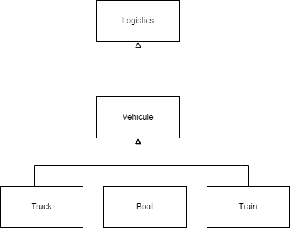

Factory
=======
Family : Creational Design Patterns

Other less common name :  *virtual constructor*

When use a factory ?
--------------------
The classic inheritance is not convenient when whe use it on multiple levels when you have to manage different type of objects and for each of them an associate logic without touching other classes.

#### Example of problem (class diagram)

This system in this case is useless because it's hard to adding a new sub-class without changing the existing codebase (Open/close SOLID principe) because the inheritance force us to deals with know objects based on super classes, no matter the class level. 
For instance if adding a Family class to add some logic on family cars.

The factory solve this problem by providing an interface that allow developers to create a factory class (e.g. VehicleFactory also named the creator class) to replace the "traditional" constructor (the `new objectName()` still working properly) and create subclasses objects independently of their type.

How create a Factory
---------------
1. Create a factory class (also call a creator), here in our study's the `TransportPlatform` witch contains an abstract method `getTransport()` that returns a `TransportInterface` object.
2. Create the interface `TransportInterface` and declares all concretes methods that all sub objects must implement (e.g. `load()` and `unload()`).
3. Create for each type a subclass (one entity object to each logic  one for truck e.g `Boat`, one for cars...) a class and implements the interface according to it's definition (mandatory methods defined in the interface) and add the logic code in each of them. **Don't forget to add the constructor method in each of them to instantiate the object !**
4. Add a creator (e.g `BoatTransport`) to overload the factory for each subbass object and so plug the entity object in the factory. 
5. In the client code inject the creator (our `TransportPlatformFactory`) and use it by calling at least one of the creator's method(s). 

That's it ! Full demo [here](#live-example).

Pros 
-----
- Single Responsibility Principle
- Open/Closed Principe 

Cons
------
- Code may overkill if they are lot of subclasses to implement because it's creates lot of classes.

Live example 
------------

- Go to the project directory with your favorite terminal : `cd ./creational/factory/practice`
- Run the composer command to update the autoloader : `composer dump-autoload`
- Run the PHP built-in server : `php -S localhost:8000 -d display_errors=On`

For more info
-------------
See [Refactoring Guru explanations](https://refactoring.guru/design-patterns/factory-method). 

There is plenty interesting things (applicability, code examples in most languages, illustrations, more info about pro & cons, relations with other patterns, advanced instructions that are be certified by the community).

Credits
---------
Diagrams have been made with the [Draw.io VS Code extension](https://marketplace.visualstudio.com/items?itemName=hediet.vscode-drawio). 

Inspired by Refactoring Guru explanations and various searches. 

